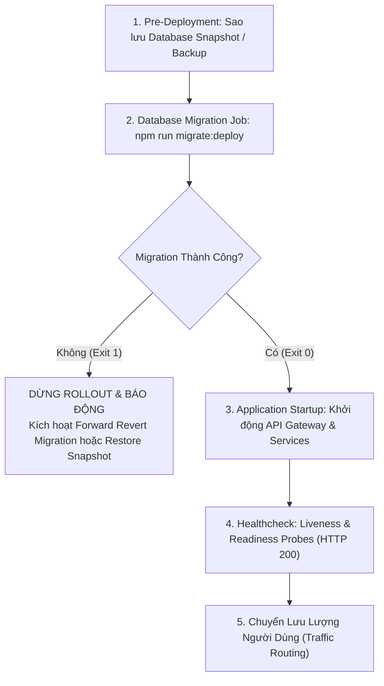

# Database Lifecycle & Migration Architecture - Phan Bón Shop

Tài liệu này quy chuẩn hóa toàn bộ vòng đời cơ sở dữ liệu (Database Lifecycle), quy trình thực thi migration, thứ tự khởi động production, và chiến lược xử lý khi cần rollback cho 6 microservices trong hệ thống Phan Bón Shop.

---

## 1. Kiến Trúc Cơ Sở Dữ Liệu & Phân Quyền Microservices

Hệ thống tuân thủ nghiêm ngặt nguyên lý **Database-per-Service** (mỗi microservice sở hữu một schema/database độc lập, không truy vấn chéo tầng database):

| Microservice | Database Tương Ứng | Port Local | Quản Lý Schema |
| :--- | :--- | :--- | :--- |
| **`auth-service`** | `auth_db` | `3307` | `services/auth-service/prisma/schema.prisma` |
| **`product-service`** | `product_db` | `3307` | `services/product-service/prisma/schema.prisma` |
| **`order-service`** | `order_db` | `3307` | `services/order-service/prisma/schema.prisma` |
| **`inventory-service`** | `inventory_db` | `3307` | `services/inventory-service/prisma/schema.prisma` |
| **`customer-service`** | `customer_db` | `3307` | `services/customer-service/prisma/schema.prisma` |
| **`content-service`** | `content_db` | `3307` | `services/content-service/prisma/schema.prisma` |

---

## 2. Quy Trình Development vs Production

### Môi Trường Development / Local:
- Cho phép sử dụng `npm run prisma:db:push` (tương đương `prisma db push`) khi đang thiết kế tính năng nhanh (prototyping), kiểm thử tại máy cá nhân.
- Khi một tính năng hoặc thay đổi schema hoàn tất, lập trình viên tạo migration bằng lệnh:
  ```bash
  npm run --workspace=@phanbonshop/<service-name> prisma:migrate:dev -- --name <ten_migration>
  ```
- File migration sinh ra trong thư mục `services/<service-name>/prisma/migrations/` được **commit vào Git repository** để kiểm soát phiên bản.

### Môi Trường Production & Staging:
- **Tuyệt đối cấm** sử dụng `prisma db push` hoặc cờ `--accept-data-loss`.
- **Bắt buộc** áp dụng Prisma Migrations thông qua script chuẩn hóa:
  ```bash
  npm run migrate:deploy
  ```
- `prisma migrate deploy` là lệnh mang tính **idempotent**:
  - Đọc bảng metadata `_prisma_migrations` của từng database.
  - Chỉ áp dụng các migration chưa từng được thực thi.
  - Nếu tất cả migration đã được áp dụng, lệnh thông báo `No pending migrations to apply` và thoát an toàn với mã `0`.
  - Có thể chạy lặp lại nhiều lần mà không gây ra bất kỳ xung đột hay thay đổi dữ liệu thừa nào.

---

## 3. Hệ Thống Scripts Chuẩn Hóa

### A. Scripts tại Root `package.json`
| Lệnh | Mục Đích |
| :--- | :--- |
| `npm run prisma:generate` | Sinh Prisma Client cho toàn bộ 6 services. Chạy tự động trong `postinstall`, `prebuild`, `pretypecheck`. |
| `npm run prisma:validate` | Chạy `npx prisma validate` kiểm tra cú pháp và tính hợp lệ của toàn bộ 6 schemas. |
| `npm run migrate:deploy` | Chạy `scripts/migrate-deploy.mjs`, thực thi `prisma migrate deploy` tuần tự qua toàn bộ 6 services. |
| `npm run prisma:db:push` | Đẩy trực tiếp schema lên database local (chỉ dùng cho development). |

### B. Scripts trong từng Microservice (`services/*/package.json`)
| Lệnh | Mục Đích |
| :--- | :--- |
| `npm run prisma:generate` | Sinh Prisma Client cho riêng service đó. |
| `npm run prisma:migrate:dev` | Tạo và áp dụng migration mới trong quá trình phát triển dev. |
| `npm run prisma:migrate:deploy` | Áp dụng các migration đang chờ lên database production. |
| `npm run prisma:validate` | Kiểm tra tính hợp lệ của `schema.prisma`. |
| `npm run prisma:db:push` | `prisma db push` cho môi trường local. |

---

## 4. Thứ Tự Khởi Động Trong Production (Startup Ordering)

Để đảm bảo hệ thống không bao giờ gặp lỗi truy vấn bảng chưa tồn tại hoặc sai lệch cấu trúc cột khi container ứng dụng khởi động, quy trình triển khai CI/CD và runtime tuân theo thứ tự nghiêm ngặt sau:



### Chi Tiết Thứ Tự:
1. **Bước 1 (Pre-flight Backup)**: Tạo snapshot hoặc backup dữ liệu trước giờ release.
2. **Bước 2 (Migration Job)**: Chạy container migration độc lập (ví dụ: Kubernetes `Job` hoặc init script) với lệnh:
   ```bash
   npm run migrate:deploy
   ```
3. **Bước 3 (Gate Check)**:
   - Nếu exit code khác `0`: Dừng ngay quá trình triển khai, không khởi động container ứng dụng mới.
   - Nếu exit code bằng `0`: Toàn bộ bảng đã sẵn sàng.
4. **Bước 4 (Application Startup)**:
   - Khởi động các microservices:
     ```bash
     node dist/main.js
     ```
   - Mỗi service chạy `validateStartupEnv` để kiểm tra biến môi trường và kết nối MySQL trước khi lắng nghe HTTP request.
5. **Bước 5 (Readiness Verification)**: API Gateway kiểm tra `/health` và `/ready` của các upstream services trước khi tiếp nhận lưu lượng truy cập.

---

## 5. Giới Hạn Rollback của Prisma & Chiến Lược Hoàn Tác (Rollback Strategy)

> [!WARNING]
> **SỰ THẬT VỀ PRISMA MIGRATIONS:**
> Prisma ORM **KHÔNG HỖ TRỢ** tính năng automatic down-migrations (không tồn tại lệnh `prisma migrate down` như Knex, Phinx hay Rails ActiveRecord). Prisma được xây dựng theo triết lý "forward-only migrations" để tránh rủi ro mất dữ liệu ngầm định khi rollback tự động.

Do Prisma không có rollback tự động, hệ thống Phan Bón Shop áp dụng **2 chiến lược rollback tiêu chuẩn công nghiệp**:

### Chiến Lược 1: Forward Rollback (Revert Migration - Khuyến Nghị cho Zero-Downtime)
Thay vì cố gắng "quay ngược thời gian", chúng ta tạo một migration mới đi về phía trước để hoàn tác thay đổi:

1. **Khi nào dùng**: Khi migration mới thêm cột, đổi kiểu dữ liệu, hoặc thêm bảng mới nhưng gây lỗi logic ở tầng ứng dụng.
2. **Cách thực hiện**:
   - Sửa lại file `schema.prisma` về trạng thái mong muốn trước đó.
   - Tạo migration đảo ngược:
     ```bash
     npx prisma migrate diff \
       --from-schema-datamodel prisma/schema.prisma \
       --to-migrations prisma/migrations \
       --script > prisma/migrations/<timestamp>_revert_feature/migration.sql
     ```
   - Hoặc tạo migration bằng `npx prisma migrate dev --name revert_<feature>`.
   - Deploy migration mới:
     ```bash
     npm run migrate:deploy
     ```
   - Cơ chế này an toàn vì nó ghi nhận lịch sử rõ ràng vào `_prisma_migrations`, không phá vỡ tính tuần tự của Git.

### Chiến Lược 2: Disaster Recovery / Snapshot Restore (Phục Hồi Thảm Họa)
Áp dụng khi migration gây phá hủy dữ liệu nghiêm trọng hoặc lỗi không thể khắc phục bằng forward migration:

1. **Khi nào dùng**: Sự cố nghiêm trọng ngoài tầm kiểm soát.
2. **Cách thực hiện**:
   - Dừng ngay container ứng dụng.
   - Khôi phục cơ sở dữ liệu từ bản snapshot đã sao lưu ở **Bước 1 của Quy trình Khởi động**.
   - Rollback mã nguồn (git revert) về commit ổn định trước đó.
   - Khởi động lại hệ thống.

---

## 6. Chính Sách Seed Dữ Liệu An Toàn

- **Production Tuyệt Đối Không Chạy Seed Tự Động**:
  - Không có bất kỳ lệnh `prisma migrate deploy` hoặc `start` nào kích hoạt seed.
  - Các file seed tại `services/auth-service/prisma/seed.ts` và `services/product-service/prisma/seed.ts` được cài đặt runtime guard:
    ```typescript
    if (process.env.NODE_ENV === 'production') {
      throw new Error('[FATAL] Tuyệt đối cấm chạy seed dữ liệu mẫu trong môi trường PRODUCTION!');
    }
    ```
  - Mọi tài khoản seed chỉ được sử dụng cho môi trường development local với domain `@local.test` và mật khẩu `DEV_SEED_PASSWORD`.
