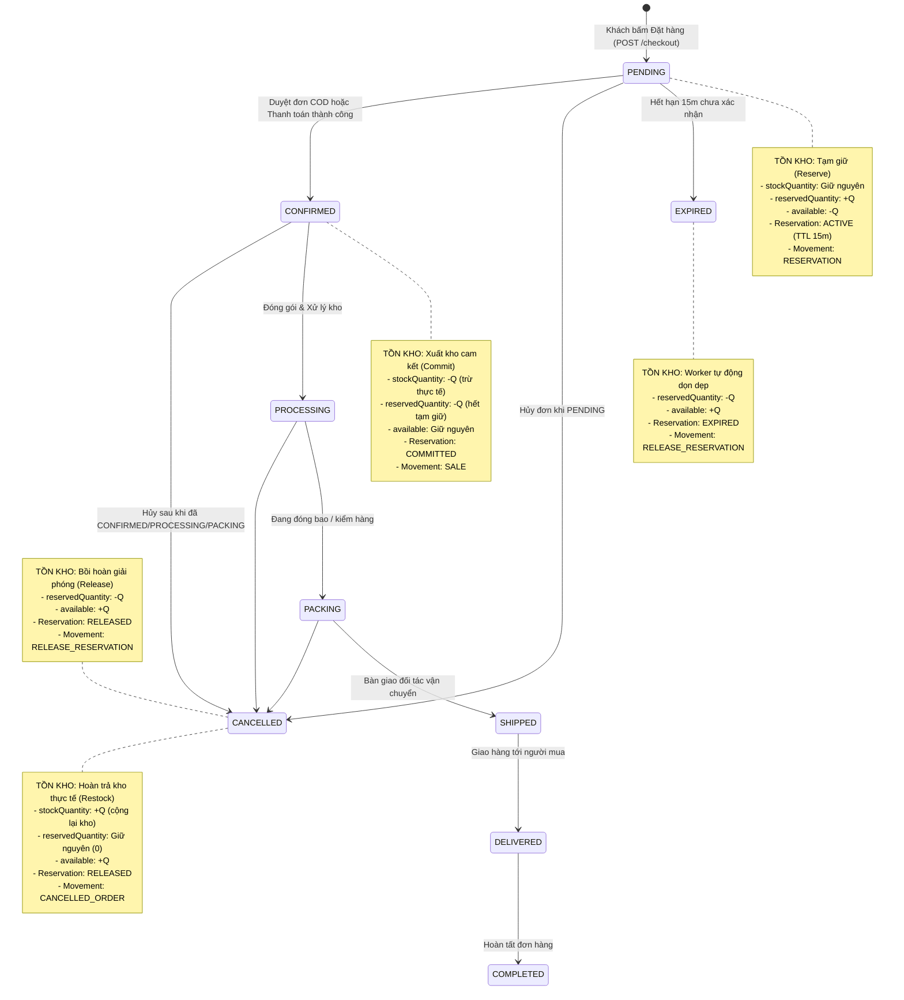

# PHANBONSHOP — MÔ HÌNH VÒNG ĐỜI TỒN KHO VÀ ĐƠN HÀNG (INVENTORY & ORDER LIFECYCLE SPECIFICATION)

> **Trạng thái:** Chuẩn hóa và áp dụng chính thức từ Phase 2 Remediation.  
> **Phạm vi áp dụng:** `services/inventory-service`, `services/order-service`, `apps/admin`, `apps/frontend`.

---

## 1. NGUYÊN TẮC BẤT BIẾN TỒN KHO (INVENTORY INVARIANTS)

Tại mọi thời điểm và trong mọi giao dịch phân tán, hệ thống cơ sở dữ liệu kho (`test_inventory_db` / `inventory_db`) phải tuân thủ nghiêm ngặt 4 bất biến toán học:

$$\text{availableQuantity} = \text{stockQuantity} - \text{reservedQuantity}$$

$$\text{stockQuantity} \ge 0$$

$$\text{reservedQuantity} \ge 0$$

$$\text{availableQuantity} \ge 0$$

*Trong đó:*
- **`stockQuantity` (Tồn kho thực tế / vật lý):** Số lượng hàng hóa thực tế đang nằm trong kho bãi của PhanBonShop, đã nhập kho và chưa xuất đi giao cho khách.
- **`reservedQuantity` (Tồn kho đang tạm giữ):** Số lượng hàng hóa đã được khách hàng đặt giữ qua các đơn hàng ở trạng thái `PENDING` (chờ xác nhận / chờ thanh toán) trong khoảng thời gian hiệu lực (Holding TTL, mặc định 15 phút).
- **`availableQuantity` (Tồn kho khả dụng để bán):** Số lượng thực tế có thể tiếp tục hiển thị trên sàn thương mại điện tử để khách khác đặt mua.
- **`SELECT ... FOR UPDATE`:** Mọi thao tác kiểm tra và thay đổi `stockQuantity` hoặc `reservedQuantity` BẮT BUỘC phải thực hiện bên trong MySQL transaction với khóa bi quan theo hàng của `variantId`.

---

## 2. MÔ HÌNH VÒNG ĐỜI ĐỒNG BỘ ĐƠN HÀNG — TỒN KHO

Hệ thống thống nhất sử dụng **Mô hình Tạm giữ theo TTL & Xuất kho khi Xác nhận (Reserve-on-Checkout / Commit-on-Confirm / Restock-on-Cancel)**:



---

## 3. MA TRẬN TRẠNG THÁI & TÁC ĐỘNG TỒN KHO

| Trạng thái Đơn hàng (`OrderStatus`) | Thao tác Tồn kho tương ứng | Trạng thái Reservation (`ReservationStatus`) | Thay đổi `stockQuantity` | Thay đổi `reservedQuantity` | Thay đổi `availableQuantity` | Loại biến động (`MovementType`) |
| :--- | :--- | :--- | :---: | :---: | :---: | :--- |
| **Bắt đầu Checkout** (`PENDING`) | `POST /internal/v1/inventory/reserve` | `ACTIVE` (Hết hạn sau 15 phút) | `0` | **`+Q`** | **`-Q`** | `RESERVATION` |
| **Xác nhận đơn** (`CONFIRMED`) | `POST /internal/v1/inventory/commit` | `COMMITTED` | **`-Q`** | **`-Q`** | `0` | `SALE` |
| **Đang xử lý / Đóng gói / Giao** (`PROCESSING`, `PACKING`, `SHIPPED`, `DELIVERED`, `COMPLETED`) | Đã xuất kho từ bước `CONFIRMED` | `COMMITTED` | `0` | `0` | `0` | *(Không ghi nhận thêm)* |
| **Hủy đơn khi đang `PENDING`** | `POST /internal/v1/inventory/release` | `RELEASED` | `0` | **`-Q`** | **`+Q`** | `RELEASE_RESERVATION` |
| **Hủy đơn sau `CONFIRMED` / `PACKING`** | `POST /internal/v1/inventory/rollback` | `RELEASED` | **`+Q`** | `0` | **`+Q`** | `CANCELLED_ORDER` |
| **Trả hàng** (`RETURNED`) | `POST /internal/v1/inventory/release` (allowRollback: true) → `executeRollbackCommitted` | `RELEASED` | **`+Q`** | `0` | **`+Q`** | `RETURN` |
| **Hết hạn 15 phút không thanh toán / xác nhận** | `POST /internal/v1/inventory/cleanup-expired` (Worker tự động) | `EXPIRED` | `0` | **`-Q`** | **`+Q`** | `RELEASE_RESERVATION` |
| **Thêm sản phẩm mới (Admin)** | `POST /api/v1/inventory/adjust` (Frontend orchestrator) | *(Không liên quan Reservation)* | **`+Q`** | `0` | **`+Q`** | `INITIAL_STOCK` |

---

## 4. CƠ CHẾ BẢO VỆ CHỐNG LỖI CONCURRENCY VÀ MULTI-REPLICA

### 4.1. Khóa bi quan chống Oversell (`SELECT ... FOR UPDATE`)
Mọi thao tác `reserve()`, `commit()`, `release()`, `rollbackOrRelease()` đều thực thi bên trong `prisma.$transaction`:
```sql
SELECT id, productId, variantId, stockQuantity, reservedQuantity, reorderLevel
FROM inventory
WHERE variantId = :variantId
FOR UPDATE;
```
Câu lệnh này thiết lập Exclusive Row Lock trên bản ghi biến thể phân bón trong MySQL InnoDB Engine, ngăn chặn hoàn toàn race condition kể cả khi 10, 50 hay 100 requests cùng tranh chấp một bao phân bón cuối cùng.

### 4.2. Cơ chế Atomic Claiming cho Expiry Worker
Khi scale nhiều container `inventory-service` chạy song song, Expiry Worker ngăn chặn việc trừ `reservedQuantity` lặp lại bằng thao tác Atomic Claim:
```ts
const claim = await tx.inventoryReservation.updateMany({
  where: {
    id: res.id,
    status: ReservationStatus.ACTIVE,
  },
  data: {
    status: ReservationStatus.EXPIRED,
  },
});

if (claim.count === 0) {
  // Worker khác đã xử lý hoặc reservation đã được commit/release trước đó
  return;
}
```
Chỉ có duy nhất worker thắng phiên `updateMany` mới có quyền khóa dòng `inventory` và trừ `reservedQuantity`. Các worker khác lập tức bỏ qua bản ghi này.

### 4.3. Bồi hoàn bền vững qua Outbox Pattern (`compensation_tasks`)
Khi `order-service` hủy đơn hàng hoặc rollback checkout mà gặp sự cố mạng tạm thời với `inventory-service` (HTTP 503, Timeout):
1. Hệ thống không nuốt lỗi (silent swallow).
2. Tự động ghi một bản ghi nhiệm vụ bồi hoàn bền vững vào bảng `compensation_tasks` với `status: 'PENDING'`.
3. Background worker của `CompensationService` định kỳ quét và thực thi lại theo cơ chế Exponential Backoff (1s, 2s, 4s, 8s...) cho tới khi thành công.

---

## 5. KIỂM ĐỊNH BẢO MẬT & TOÀN VẸN
1. Tuyệt đối không có bất kỳ dòng code nào trừ trực tiếp `stockQuantity` trước khi tạo reservation.
2. Tuyệt đối không cho phép chuyển trạng thái đơn hàng sang `CANCELLED` mà bỏ quên việc giải phóng hoặc hoàn trả tồn kho.
3. Mọi biến động kho đều bắt buộc sinh một bản ghi `inventory_movements` làm sổ cái kiểm toán kế toán.
