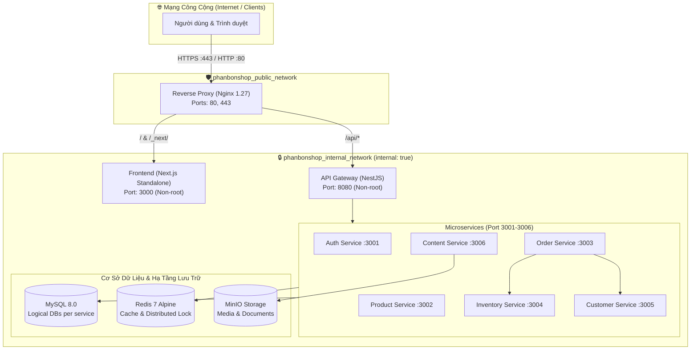

# Hướng Dẫn Triển Khai Container & Kiến Trúc Production (Production Container Architecture)

Tài liệu này quy chuẩn kiến trúc container hóa, cấu hình mạng an toàn, quy trình quản lý bí mật (secrets), chứng chỉ HTTPS/TLS và vòng đời khởi động hệ thống cho nền tảng thương mại điện tử **Phan Bon Shop**.

---

## 1. Tổng Quan Kiến Trúc Container (Container Architecture)

Kiến trúc production của Phan Bon Shop gồm 12 thành phần được container hóa hoàn toàn, tuân thủ nghiêm ngặt nguyên lý **Defense-in-Depth** và **Least Privilege**:



### Nguyên Tắc An Toàn Cốt Lõi:
1. **Cô lập cổng (Port Isolation)**: Chỉ duy nhất `reverse-proxy` (Nginx) mở cổng public (`80:80` và `443:443`). Toàn bộ MySQL (`3306`), Redis (`6379`), MinIO (`9000/9001`) và các cổng microservices nội bộ (`3001-3006`, `8080`, `3000`) **tuyệt đối không mở ra ngoài máy chủ (No published host ports)**.
2. **Mạng nội bộ cách ly (`internal: true`)**: Docker bridge `phanbonshop_internal_network` được gán cờ `internal: true`. Điều này ngăn chặn hoàn toàn việc các container dữ liệu bị truy cập trực tiếp từ bên ngoài hoặc rò rỉ kết nối ngoài ý muốn.
3. **Non-Root Execution**: Toàn bộ Next.js, API Gateway và 6 microservices thực thi dưới user hệ thống không có quyền root (`USER node:node`, UID/GID 1000).
4. **Không sao chép `node_modules` từ máy host**: Tất cả Dockerfile đều là Multi-stage (`deps` / `builder` / `runner`), cài đặt sạch bằng `npm ci` trong môi trường build cô lập và chỉ giữ lại mã nguồn biên dịch + runtime dependencies.

---

## 2. Reverse Proxy & Định Tuyến (Routing)

Nginx đóng vai trò là L7 Reverse Proxy và điểm kết thúc SSL (SSL Termination).

### Định tuyến:
- `GET /healthz` ➔ Phục vụ bộ dò liveness/readiness của hạ tầng container hoặc load balancer (trả về HTTP 200 `healthy`).
- `/api/*` ➔ Chuyển tiếp về API Gateway (`http://gateway:8080/api/*`).
- `/_next/static/*` ➔ Tối ưu hóa bộ nhớ đệm trình duyệt cho static assets của Next.js (cache 365 ngày với header `immutable`).
- `/*` ➔ Chuyển tiếp về Frontend application (`http://frontend:3000`).

### Tiêu chuẩn HTTP & Security Headers được kích hoạt:
- `client_max_body_size 25M` (hỗ trợ upload hình ảnh phân bón và hóa đơn).
- `X-Content-Type-Options: nosniff` (chống MIME-sniffing).
- `X-Frame-Options: SAMEORIGIN` (chống Clickjacking).
- `X-XSS-Protection: 1; mode=block` (chống Cross-site scripting).
- `Referrer-Policy: strict-origin-when-cross-origin`.
- Hỗ trợ WebSocket Upgrade (`Connection: upgrade`).

---

## 3. Quy Chuẩn HTTPS / TLS Cho Môi Trường Production

> [!CAUTION]
> **Tuyệt đối không commit file Private Key (`*.key`), Chứng chỉ (`*.crt`, `*.pem`) hoặc file `.env.production` vào Git repository hoặc nhúng trực tiếp vào Docker image.** Mọi file chứng chỉ và bí mật chỉ được nạp tại thời điểm runtime (mount qua Docker volume hoặc bí mật hệ thống).

### 3.1. Thiết lập chứng chỉ SSL/TLS tự động với Let's Encrypt / Certbot

1. **Khởi tạo chứng chỉ Let's Encrypt**:
   ```bash
   # Cài đặt certbot trên máy chủ host
   sudo apt update && sudo apt install certbot python3-certbot-nginx -y

   # Lấy chứng chỉ cho domain chính và api
   sudo certbot certonly --standalone -d phanbonshop.vn -d www.phanbonshop.vn -d api.phanbonshop.vn --agree-tos --email admin@phanbonshop.vn
   ```

2. **Cấu hình chứng chỉ vào Nginx**:
   Các file chứng chỉ được tạo tại `/etc/letsencrypt/live/phanbonshop.vn/`:
   - `fullchain.pem`: Chuỗi chứng chỉ công khai (Certificate + Intermediate CA).
   - `privkey.pem`: Khóa bí mật (Private key).

   Khi triển khai bằng `docker-compose.prod.yml`, mount thư mục này vào Nginx:
   ```yaml
   volumes:
     - /etc/letsencrypt/live/phanbonshop.vn/fullchain.pem:/etc/nginx/certs/fullchain.pem:ro
     - /etc/letsencrypt/live/phanbonshop.vn/privkey.pem:/etc/nginx/certs/privkey.pem:ro
   ```

3. **Template Server Block SSL (bổ sung vào `docker/nginx/conf.d/default.conf` khi bật HTTPS)**:
   ```nginx
   # Chuyển hướng toàn bộ HTTP sang HTTPS
   server {
       listen 80;
       listen [::]:80;
       server_name phanbonshop.vn www.phanbonshop.vn;

       location /.well-known/acme-challenge/ {
           root /var/www/certbot;
       }

       location / {
           return 301 https://$host$request_uri;
       }
   }

   # Máy chủ HTTPS an toàn
   server {
       listen 443 ssl http2;
       listen [::]:443 ssl http2;
       server_name phanbonshop.vn www.phanbonshop.vn;

       ssl_certificate /etc/nginx/certs/fullchain.pem;
       ssl_certificate_key /etc/nginx/certs/privkey.pem;

       # Giao thức và chuẩn mã hóa hiện đại
       ssl_protocols TLSv1.2 TLSv1.3;
       ssl_ciphers ECDHE-ECDSA-AES128-GCM-SHA256:ECDHE-RSA-AES128-GCM-SHA256:ECDHE-ECDSA-AES256-GCM-SHA384:ECDHE-RSA-AES256-GCM-SHA384;
       ssl_prefer_server_ciphers off;

       # Tối ưu SSL session cache
       ssl_session_timeout 1d;
       ssl_session_cache shared:SSL:10m;
       ssl_session_tickets off;

       # HSTS (Strict-Transport-Security)
       add_header Strict-Transport-Security "max-age=63072000; includeSubDomains; preload" always;

       # Định tuyến proxy tới frontend và gateway
       location /healthz {
           access_log off;
           return 200 "healthy\n";
       }

       location /api/ {
           proxy_pass http://gateway_upstream;
           proxy_http_version 1.1;
           proxy_set_header Host $host;
           proxy_set_header X-Real-IP $remote_addr;
           proxy_set_header X-Forwarded-For $proxy_add_x_forwarded_for;
           proxy_set_header X-Forwarded-Proto https;
       }

       location / {
           proxy_pass http://frontend_upstream;
           proxy_http_version 1.1;
           proxy_set_header Upgrade $http_upgrade;
           proxy_set_header Connection "upgrade";
           proxy_set_header Host $host;
           proxy_set_header X-Real-IP $remote_addr;
           proxy_set_header X-Forwarded-For $proxy_add_x_forwarded_for;
           proxy_set_header X-Forwarded-Proto https;
       }
   }
   ```

4. **Tự động gia hạn (Auto-renewal Cron)**:
   ```bash
   # Thêm vào crontab máy chủ host (kiểm tra mỗi tuần và tự reload nginx container khi gia hạn xong)
   0 3 * * 1 certbot renew --quiet --post-hook "docker compose -f /opt/phanbonshop/docker-compose.prod.yml exec -T reverse-proxy nginx -s reload"
   ```

---

## 4. Quản Lý Bí Mật & Biến Môi Trường Production (Secrets Management)

Mọi biến môi trường nhạy cảm trong production được cấu hình qua file `.env` trên máy chủ deployment (phân quyền `chmod 600 .env`), **không bao giờ commit vào Git**:

### Bảng biến môi trường bắt buộc:
| Biến môi trường | Mục đích | Yêu cầu production |
|---|---|---|
| `MYSQL_ROOT_PASSWORD` | Mật khẩu tài khoản root MySQL | Chuỗi ngẫu nhiên tối thiểu 32 ký tự |
| `MYSQL_USER` | Tên user ứng dụng | `phanbon_user` (hoặc tên tùy biến) |
| `MYSQL_PASSWORD` | Mật khẩu user ứng dụng kết nối 6 DBs | Chuỗi ngẫu nhiên mạnh |
| `REDIS_PASSWORD` | Mật khẩu xác thực Redis 7 | Chuỗi ngẫu nhiên mạnh |
| `MINIO_ROOT_USER` | Quản trị viên lưu trữ MinIO | User an toàn (không dùng `admin`) |
| `MINIO_ROOT_PASSWORD` | Mật khẩu MinIO | Tối thiểu 16 ký tự |
| `JWT_SECRET` | Khóa ký phiên JWT người dùng | Tối thiểu 32 ký tự, mã hóa cao |
| `INTERNAL_SERVICE_SECRET` | Secret xác thực liên microservice (`x-internal-service`) | Bí mật chia sẻ giữa Gateway & Services |
| `CORS_ALLOWED_ORIGINS` | Danh sách domain được phép gọi API | Khai báo URL chính xác (ví dụ: `https://phanbonshop.vn`) |

Package `@phanbonshop/config` sẽ tự động xác thực các biến này khi container khởi động. Nếu thiếu bất kỳ biến nào trong chế độ `NODE_ENV=production`, container sẽ dừng ngay lập tức (fail-fast) với thông báo lỗi chi tiết.

---

## 5. Thứ Tự Khởi Động & Triển Khai Production (Production Startup Sequence)

Để đảm bảo tính toàn vẹn dữ liệu và không gây downtime, thứ tự khởi động được tự động hóa qua `depends_on` và Docker healthchecks theo trình tự sau:

### Bước 1: Khởi động tầng Hạ Tầng & Cơ Sở Dữ Liệu
```bash
docker compose -f docker-compose.prod.yml up -d mysql redis minio minio-init-buckets
```
- Đợi MySQL, Redis và MinIO chuyển sang trạng thái `healthy`.
- Service `minio-init-buckets` tự động tạo bucket và phân quyền đọc công khai cho hình ảnh.

### Bước 2: Chạy Database Migration (Bắt buộc trước khi chạy code mới)
```bash
npm run migrate:deploy
# Hoặc chạy script độc lập:
node scripts/migrate-deploy.mjs
```
- Lệnh `prisma migrate deploy` là **idempotent**, áp dụng tuần tự các migration cho 6 services mà không xóa hay làm hỏng dữ liệu hiện tại.

### Bước 3: Khởi động toàn bộ Hệ Thống Microservices & Frontend
```bash
docker compose -f docker-compose.prod.yml up -d
```
- Thứ tự kích hoạt tự động theo đồ thị phụ thuộc:
  1. `auth`, `product`, `order`, `inventory`, `customer`, `content` khởi động và kiểm tra kết nối DB.
  2. Mỗi microservice vượt qua health check nội bộ (`GET /health`).
  3. `gateway` khởi động sau khi toàn bộ microservices và Redis đều ở trạng thái `healthy`.
  4. `frontend` khởi động sau khi build standalone.
  5. `reverse-proxy` (Nginx) khởi động cuối cùng, tiếp nhận lưu lượng HTTP/HTTPS từ người dùng.

### Bước 4: Kiểm tra trạng thái hệ thống
```bash
docker compose -f docker-compose.prod.yml ps
```
Tất cả các container phải hiển thị trạng thái `Up (healthy)`.

---

## 6. Lệnh Vận Hành & Bảo Trì Thường Gặp

```bash
# Xem log toàn hệ thống theo thời gian thực
docker compose -f docker-compose.prod.yml logs -f

# Xem log riêng của một microservice (ví dụ order-service)
docker compose -f docker-compose.prod.yml logs -f order

# Kiểm tra tình trạng tài nguyên (CPU, RAM) của các container
docker stats

# Khởi động lại Reverse Proxy mà không làm gián đoạn ứng dụng
docker compose -f docker-compose.prod.yml restart reverse-proxy

# Cập nhật một service mà không gián đoạn các service khác
docker compose -f docker-compose.prod.yml build product
docker compose -f docker-compose.prod.yml up -d --no-deps product
```
